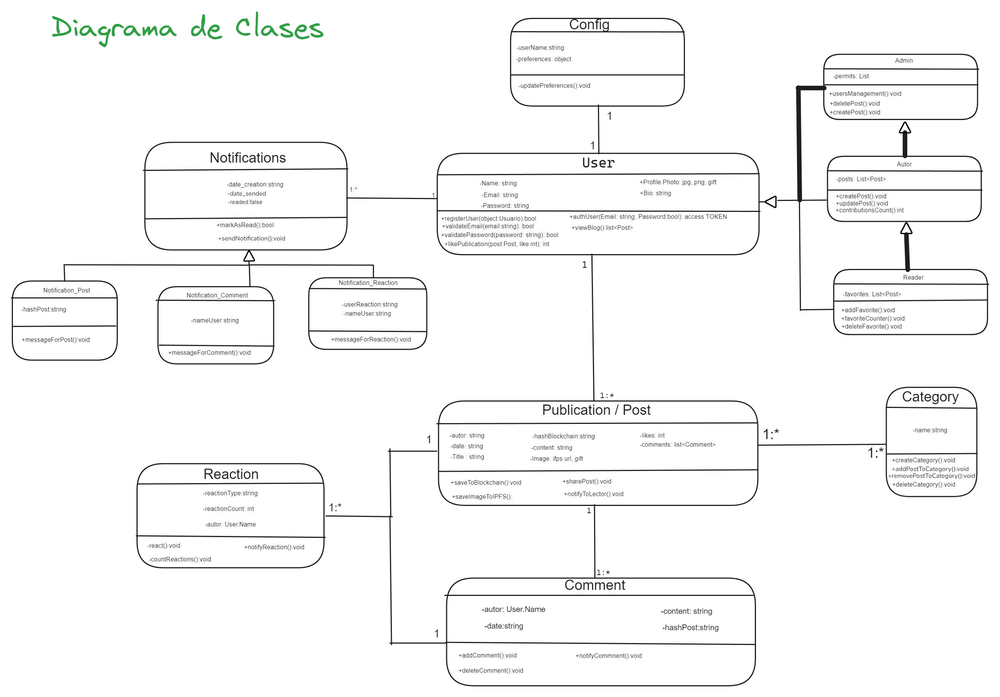

# SIV
#### Semillero de Videojuegos - Universidad Tecnologica de Pereira

### [Backend](#backend)
### [Frontend](#Frontend)

Este proyecto es un blog diseñado para registrar el progreso de un semillero de investigación, utilizando tecnología blockchain para asegurar la inmutabilidad y autenticidad de los posts.

# Backend
## Tecnologías Utilizadas
  Se desarrollo el backend utilizando Node.js, y para mejorar la eficiencia y escalabilidad del proyecto, se utilizaron las siguientes tecnologías:

- **Web3.js**: Para interactuar con la red de Ethereum.
- **Infura**: Para conectarse a la red de Ethereum en el servidor.
- **SQLite3**: Base de datos relacional ligera.
- **Express**: Framework para Node.js, facilitando la creación de APIs RESTful.
- **bcryptjs**: Para hashear las contraseñas de los usuarios.
- **jsonwebtoken (JWT)**: Para la autenticación de usuarios mediante tokens.
- **Sequelize**: ORM para gestionar la base de datos SQLite3.
- **Nodemon**: Para reiniciar automáticamente el servidor al guardar cambios en el código.

## Estructura del Servidor

La estructura de carpetas está diseñada para mantener el proyecto organizado, modularizado y si es necesario en un futuro facilitar su escalabilidad:

### `connection`
Esta carpeta se encargará de la conexión a la base de datos y a la red de Ethereum. Está dividida en tres secciones:

- **db**: Maneja la conexión a la base de datos SQLite3.
- **middleware**: Maneja la conexión a la red de Ethereum y la autenticación de usuarios.
- **utils**: Funciones o servicios necesarios para relacionar los módulos con la base de datos y la red de Ethereum.

### `modules`
La carpeta de módulos se organiza según el siguiente diagrama de clases, reflejando la cantidad de módulos, sus relaciones, atributos y métodos:



Para cada módulo, se incluyen las siguientes subcarpetas:

- **controller**: Maneja las peticiones y respuestas de la aplicación.
- **models**: Define la estructura de la base de datos.
- **routes**: Define las rutas de la aplicación y valida los datos enviados a la API.
- **utils**: Contiene la lógica o servicios que requiere la aplicación.

### `interfaces`
Esta carpeta contiene las interfaces necesarias para la validación de datos de cada módulo, asegurando que se integren correctamente los métodos para cada clase implementada.

## Base de Datos

Utilizamos SQLite3 como base de datos. La base de datos se llamará `SIV.db` y contendrá las siguientes tablas y relaciones, basadas en el diagrama implementado para las clases:


## Instalación y Configuración

1. **Clonar el repositorio**.


2. **Instalar las dependencias**:
    ```bash
    npm install
    ```

3. **Configurar las variables de entorno**:
    Crea un archivo `.env` en la raíz del proyecto con las siguientes variables:
    ```plaintext
    PORT=
    JWT_SECRET=
    DATABASE_URL=
    ```

4. **Iniciar el servidor con nodemon**:
    ```bash
    npm run dev
    ```

## Contribución

1. **Fork el repositorio**
2. **Crea una nueva rama** (`git checkout -b feature/nueva-funcionalidad`)
3. **Haz commit de tus cambios** (`git commit -am 'Añadir nueva funcionalidad'`)
4. **Haz push a la rama** (`git push origin feature/nueva-funcionalidad`)
5. **Abre una Pull Request**

## Licencia

Este proyecto está licenciado,  [License](./LICENSE.md).

